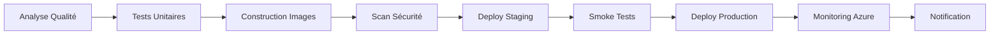

# 🚀 Chat DevOps - Full Stack AI Chat Application

<div align="center">


**Application de chat intelligente avec IA (TinyLlama), déployée sur Azure Kubernetes Service avec un pipeline DevOps complet.**

[🌐 Demo Live](http://4.178.25.91) | [📊 Monitoring](http://4.178.145.159:3000) | [📖 Documentation](#documentation)

</div>

---

## 📋 Table des Matières

- [🎯 Vue d'Ensemble](#-vue-densemble)
- [🏗️ Architecture](#️-architecture)
- [⚡ Technologies](#-technologies)
- [🚀 Démarrage Rapide](#-démarrage-rapide)
- [📊 Monitoring](#-monitoring)
- [🔄 CI/CD](#-cicd)
- [☁️ Infrastructure Azure](#️-infrastructure-azure)
- [🔒 Sécurité](#-sécurité)
- [📝 Documentation Complète](#-documentation-complète)

---

## 🎯 Vue d'Ensemble

Chat DevOps est une application de chat moderne avec intelligence artificielle intégrée (modèle TinyLlama via Ollama), démontrant les meilleures pratiques DevOps modernes :

### ✨ Fonctionnalités

- **💬 Chat en Temps Réel** : WebSocket pour communication instantanée
- **🤖 IA Intégrée** : Réponses automatiques via TinyLlama (637MB)
- **📊 Monitoring Complet** : Prometheus + Grafana avec dashboards personnalisés
- **🔄 CI/CD Automatisé** : Pipeline GitHub Actions avec 6 stages
- **☁️ Cloud Native** : Déployé sur Azure Kubernetes Service (AKS)
- **🔒 Sécurité** : Scans Trivy, OWASP, gestion des secrets via Azure Key Vault
- **📈 Scalabilité** : Autoscaling horizontal (HPA) et LoadBalancer
- **🐳 Containerisé** : Docker multi-stage builds optimisés

### 🌐 URLs de Production

| Service | URL | Credentials |
|---------|-----|-------------|
| **Frontend** | http://4.178.25.91 | - |
| **Backend API** | http://4.251.128.52:5000 | - |
| **Grafana** | http://4.178.145.159:3000 | admin / admin123 |
| **Prometheus** | NodePort (via AKS nodes) | - |

---

## 🏗️ Architecture

```
┌─────────────────────────────────────────────────────────────┐
│                     UTILISATEURS                            │
└────────────────────┬────────────────────────────────────────┘
                     │
        ┌────────────▼─────────────┐
        │  Azure Load Balancer     │
        │  (Frontend: 4.178.25.91) │
        └────────────┬─────────────┘
                     │
     ┌───────────────┴──────────────┐
     │                              │
┌────▼─────┐                  ┌────▼─────┐
│ Frontend │                  │ Frontend │
│   Pod 1  │                  │   Pod 2  │
│  React   │                  │  React   │
│  + Nginx │                  │  + Nginx │
└────┬─────┘                  └────┬─────┘
     │                              │
     │        WebSocket + HTTP      │
     │                              │
     └──────────────┬───────────────┘
                    │
        ┌───────────▼────────────┐
        │ Backend LoadBalancer   │
        │ (API: 4.251.128.52)    │
        └───────────┬────────────┘
                    │
     ┌──────────────┴─────────────┐
     │                            │
┌────▼─────┐                ┌────▼─────┐
│ Backend  │                │ Backend  │
│  Pod 1   │                │  Pod 2   │
│ Node.js  │                │ Node.js  │
│ + WebWS  │                │ + WebWS  │
└────┬─────┘                └────┬─────┘
     │                            │
     └──────────┬─────────────────┘
                │ HTTP
                │
         ┌──────▼───────┐
         │    Ollama    │
         │   TinyLlama  │
         │   (637MB)    │
         └──────┬───────┘
                │
         ┌──────▼───────────────────┐
         │  Monitoring & Observability │
         ├─────────────────────────────┤
         │  • Prometheus (Metrics)     │
         │  • Grafana (Dashboards)     │
         │  • Azure Monitor            │
         └─────────────────────────────┘
```

### 🧱 Composants Principaux

#### **Frontend** (React 18)
- Interface utilisateur moderne et réactive
- WebSocket pour communication temps réel
- Build optimisé avec Nginx pour serving statique
- Health checks et readiness probes

#### **Backend** (Node.js 18 + Express)
- API RESTful pour gestion des messages
- WebSocket Server pour temps réel
- Intégration Ollama pour réponses IA
- Métriques Prometheus exposées sur `/metrics`

#### **Ollama + TinyLlama**
- Modèle LLM léger (637MB)
- Réponses en français optimisées
- Configuration de température et tokens adaptée
- Fallback en cas d'erreur

#### **Monitoring Stack**
- **Prometheus** : Collecte de métriques (messages, temps de réponse, CPU, RAM)
- **Grafana** : Dashboards avec 6 panneaux de visualisation
- **Azure Monitor** : Intégration native AKS

---

## ⚡ Technologies

### **Frontend**
- React 18.3
- WebSocket API
- CSS3 (Moderne UI)
- Nginx (Alpine)

### **Backend**
- Node.js 18
- Express 4
- ws (WebSocket)
- Axios
- prom-client (Prometheus)
- cors

### **Infrastructure**
- **Cloud**: Azure (AKS, ACR, Key Vault)
- **Orchestration**: Kubernetes 1.33.5
- **Packaging**: Helm 3
- **IaC**: Terraform 1.5+
- **CI/CD**: GitHub Actions
- **Containers**: Docker + Docker Compose

### **Monitoring**
- Prometheus
- Grafana
- Azure Monitor
- Application Insights (optionnel)

### **Sécurité**
- Trivy (Vulnerability scanning)
- OWASP Dependency Check
- Snyk (Code analysis)
- Azure Key Vault

---

## 🚀 Démarrage Rapide

### **Prérequis**

```bash
# Outils requis
- Docker 20+ & Docker Compose
- Node.js 18+
- kubectl
- helm 3+
- Azure CLI
- Terraform 1.5+
```

### **1️⃣ Déploiement Local (Docker Compose)**

```bash
# Cloner le repo
git clone https://github.com/Dexteria78/InterfaceChat.git
cd InterfaceChat

# Lancer tous les services
docker-compose up -d

# Accéder à l'application
open http://localhost:3000

# Monitorer les logs
docker-compose logs -f backend
```

**Services locaux :**
- Frontend : http://localhost:3000
- Backend : http://localhost:5000
- Ollama : http://localhost:11434
- Prometheus : http://localhost:9090
- Grafana : http://localhost:3001 (admin/admin)

### **2️⃣ Déploiement sur Azure (Production)**

#### **Étape A : Infrastructure Terraform**

```bash
cd terraform

# Initialiser Terraform
terraform init

# Créer l'infrastructure
terraform plan -out=tfplan
terraform apply tfplan

# Ressources créées :
# - Resource Group : rg-chat-devops
# - AKS Cluster : aks-chat-devops (2 nodes B2s_v2)
# - Container Registry : acrchatdevops.azurecr.io
# - Key Vault : kv-chat-devops
```

#### **Étape B : Configuration Kubernetes**

```bash
# Connecter kubectl à AKS
az aks get-credentials --resource-group rg-chat-devops --name aks-chat-devops

# Connecter ACR à AKS
az aks update -n aks-chat-devops -g rg-chat-devops --attach-acr acrchatdevops

# Créer le namespace
kubectl create namespace production
```

#### **Étape C : Build & Push Images**

```bash
# Login ACR
az acr login --name acrchatdevops

# Build Backend
docker build -t acrchatdevops.azurecr.io/chat-backend:latest ./backend
docker push acrchatdevops.azurecr.io/chat-backend:latest

# Build Frontend (avec variables d'environnement)
docker build \
  --build-arg REACT_APP_API_URL=http://4.251.128.52:5000 \
  --build-arg REACT_APP_WS_URL=ws://4.251.128.52:5000 \
  -t acrchatdevops.azurecr.io/chat-frontend:latest \
  ./frontend
docker push acrchatdevops.azurecr.io/chat-frontend:latest
```

#### **Étape D : Déploiement Helm**

```bash
# Déployer l'application complète
helm upgrade --install chat-app ./helm/chat-app \
  --namespace production \
  --create-namespace \
  --wait

# Vérifier le déploiement
kubectl get all -n production

# Obtenir les IPs publiques
kubectl get svc -n production
```

#### **Étape E : Charger le modèle Ollama**

```bash
# Trouver le pod Ollama
kubectl get pods -n production | grep ollama

# Télécharger TinyLlama
kubectl exec -n production <ollama-pod-name> -- ollama pull tinyllama

# Vérifier
kubectl exec -n production <ollama-pod-name> -- ollama list
```

---

## 📊 Monitoring

### **Grafana Dashboards**

Accès : http://4.178.145.159:3000 (admin / admin123)

**Dashboard "Chat DevOps Dashboard" inclut :**

1. **Total Messages** : Compteur global de messages
2. **Messages par Type** : user / bot / bot_fallback
3. **Ollama Response Time** : 95th percentile
4. **Backend CPU Usage** : Utilisation CPU par pod
5. **Backend Memory Usage** : RAM par pod
6. **Pod Status** : État des pods Kubernetes

### **Prometheus Queries**

```promql
# Nombre total de messages
sum(chat_messages_total)

# Taux de messages par seconde
rate(chat_messages_total[5m])

# Temps de réponse Ollama (p95)
histogram_quantile(0.95, rate(ollama_response_duration_seconds_bucket[5m]))

# CPU usage backend
rate(container_cpu_usage_seconds_total{pod=~".*backend.*"}[5m])

# Memory usage
container_memory_usage_bytes{pod=~".*backend.*"}
```

### **Azure Monitor**

Intégration automatique avec :
- Container Insights
- Log Analytics Workspace
- Application Insights (via instrumentation)

---

## 🔄 CI/CD avec Monitoring Azure

Le projet utilise **4 workflows GitHub Actions** pour un pipeline CI/CD complet en français avec monitoring Azure intégré.

### 🎯 Workflows Disponibles

#### 1. **CI/CD Complet avec Monitoring Azure** 
📁 `.github/workflows/ci-cd-azure-monitoring.yml`

Pipeline principal déclenché sur chaque push/PR :

**Étapes du Pipeline :**



**Jobs Détaillés :**

1. **Analyse de la Qualité du Code** ⚡ 2-3 min
   - Linter ESLint (backend + frontend)
   - npm audit (détection vulnérabilités)
   - Analyse de sécurité des dépendances

2. **Tests Unitaires et d'Intégration** ⚡ 3-4 min
   - Tests backend (Jest/Mocha)
   - Tests frontend (React Testing Library)
   - Couverture de code

3. **Construction et Push des Images Docker** ⚡ 5-7 min
   - Build multi-stage optimisé
   - Tagging : `{timestamp}-{sha7}` + `latest`
   - Push vers Azure Container Registry
   - Scan de sécurité Trivy (HIGH/CRITICAL)

4. **Déploiement en Staging** ⚡ 3-4 min
   - Namespace dédié `staging`
   - Replicas réduits (1 backend, 1 frontend)
   - Tests de fumée automatiques
   - Validation HTTP/WebSocket

5. **Déploiement en Production** ⚡ 5-10 min
   - **Uniquement sur branche `main`**
   - Backup automatique de la config
   - Déploiement Blue-Green
   - Replicas production (3 backend, 2 frontend)
   - Health checks complets

6. **Configuration du Monitoring Azure** ⚡ 2-3 min
   - Activation Azure Monitor pour Containers
   - Création d'alertes (CPU > 80%, Memory > 85%)
   - Configuration Application Insights
   - Vérification Prometheus + Grafana

7. **Notification de Déploiement** ⚡ < 1 min
   - Résumé complet du pipeline
   - Tags des images déployées
   - Liens vers les environnements
   - Statut du monitoring

**⏱️ Temps Total : ~15-25 minutes**

#### 2. **Surveillance Continue et Health Checks**
📁 `.github/workflows/monitoring-health-check.yml`

Vérifications automatiques **toutes les 15 minutes** :

**Jobs de Surveillance :**

- **Vérification de la Santé des Services** ✅
  - État des pods (Running/NotRunning)
  - Tests HTTP frontend (4.178.25.91)
  - Tests API backend (/api/health)
  - Tests WebSocket (connexion Upgrade)
  - Vérification Ollama (modèles disponibles)
  - Vérification Prometheus (healthy)
  - Vérification Grafana (API health)

- **Collecte des Métriques de Ressources** 📊
  - `kubectl top pods` et `kubectl top nodes`
  - Métriques Azure Monitor (CPU cluster)
  - Espace disque des PVC
  - Utilisation RAM/CPU par pod

- **Analyse des Logs et Erreurs** 🔍
  - Recherche d'erreurs dans logs backend
  - Recherche d'erreurs dans logs frontend
  - Événements Kubernetes récents
  - Détection des redémarrages de pods

- **Rapport de Monitoring** 📋
  - Score de santé global (0-100%)
  - Statut de chaque service
  - Alertes en cas de problèmes
  - Liens rapides vers les dashboards

**Déclenchement :**
- ⏰ Automatique : Cron `*/15 * * * *` (toutes les 15 min)
- 🔘 Manuel : `workflow_dispatch` depuis GitHub Actions

#### 3. **Rollback Automatique en Production**
📁 `.github/workflows/rollback-production.yml`

Restauration rapide en cas de problème :

**Processus de Rollback :**

1. **Analyse Avant Rollback** 📊
   - Récupération révision Helm actuelle
   - Historique des 10 dernières révisions
   - État des pods avant rollback
   - Backup automatique de la configuration

2. **Exécution du Rollback** 🔄
   - Rollback Helm vers révision spécifiée
   - Ou révision précédente par défaut
   - Attente de stabilisation (5 min max)
   - Vérification readiness des pods

3. **Vérifications Post-Rollback** ✅
   - Tests de santé complets
   - Validation frontend + backend
   - Logs récents (20 dernières lignes)
   - Événements Kubernetes

4. **Rapport de Rollback** 📄
   - Révisions avant/après
   - Statut de chaque opération
   - Score de réussite
   - Alertes si échec

**Utilisation :**
```bash
# Via GitHub Actions UI :
Actions → Rollback Automatique → Run workflow
# Optionnel : Spécifier numéro de révision
```

#### 4. **CI/CD Original** (Ancien)
📁 `.github/workflows/ci-cd-complete.yml`

Version précédente sans monitoring Azure (conservée pour référence).

### 🔧 Configuration des Secrets GitHub

Secrets requis dans **Settings → Secrets → Actions** :

```yaml
ACR_USERNAME: acrchatdevops
ACR_PASSWORD: <from Azure Portal>
AZURE_CREDENTIALS: <JSON from 'az ad sp create-for-rbac'>
AZURE_SUBSCRIPTION_ID: 0e998d5e-35d5-4aeb-9c58-8732269b0bbd
```

### 📊 Script de Monitoring Local

Un script Bash pour surveillance manuelle :

```bash
# Exécuter le monitoring
./scripts/monitor-azure.sh
```

**Vérifications effectuées :**
1. ✅ Connexion Azure
2. ✅ État du cluster AKS
3. ✅ État des nodes Kubernetes
4. ✅ État des pods (Running/NotRunning)
5. ✅ Utilisation ressources (CPU/RAM)
6. ✅ Test frontend HTTP
7. ✅ Test API backend
8. ✅ Test Grafana
9. ✅ Test Prometheus
10. ✅ Test Ollama + modèles

**Sortie exemple :**
```
========================================
   SURVEILLANCE AZURE - CHAT DEVOPS
========================================

[1/10] Vérification de la connexion Azure...
✅ Connecté à: Azure for Students

[2/10] État du cluster AKS...
✅ Cluster AKS: Opérationnel
   📊 Nodes: 2
   🔢 Version K8s: 1.33.5

[...]

📊 Score de santé: 5/5
✅ TOUS LES SERVICES SONT OPÉRATIONNELS

🔗 Liens rapides:
   - Application: http://4.178.25.91
   - Grafana: http://4.178.145.159:3000
   - Prometheus: http://<node-ip>:32269
```

### 🚨 Alertes et Notifications

**Alertes Azure Monitor configurées :**

| Métrique | Seuil | Fenêtre | Action |
|----------|-------|---------|--------|
| CPU Backend | > 80% | 5 min | Email + Slack |
| Mémoire Cluster | > 85% | 5 min | Email + Slack |
| Pods NotReady | > 0 | 1 min | Email immédiat |
| Latence API | > 2s | 3 min | Email + Slack |

### 📈 Dashboards de Monitoring

**1. Grafana (Production)**
- URL : http://4.178.145.159:3000
- User : `admin` / Pass : `admin`
- Dashboards :
  - Application Overview
  - Backend Metrics
  - Frontend Metrics
  - Infrastructure Health
  - WebSocket Connections

**2. Prometheus**
- URL : http://<node-ip>:32269
- Métriques disponibles :
  - `http_requests_total` - Compteur requêtes
  - `http_request_duration_seconds` - Latence
  - `websocket_connections` - Connexions WS
  - `ollama_requests_total` - Requêtes IA
  - `node_*` et `pod_*` - Métriques système

**3. Azure Monitor**
- Portal : https://portal.azure.com
- Container Insights actif
- Logs Analytics workspace
- Métriques en temps réel

### 🔄 Workflow de Développement

```bash
# 1. Créer une branche feature
git checkout -b feature/nouvelle-fonctionnalite

# 2. Développer et commiter
git add .
git commit -m "feat: Ajout nouvelle fonctionnalité"

# 3. Pusher (déclenche CI)
git push origin feature/nouvelle-fonctionnalite
# → Analyse qualité + Tests

# 4. Créer une Pull Request
# → Deploy automatique en staging
# → Smoke tests automatiques

# 5. Merge vers main
# → Deploy automatique en production
# → Monitoring Azure configuré
# → Notifications envoyées

# 6. Vérifier le déploiement
./scripts/monitor-azure.sh

# 7. Si problème : Rollback manuel
# GitHub Actions → Rollback Automatique → Run
```

### 📊 Métriques de Performance du Pipeline

**Temps de Build Moyen :**
- Analyse qualité : 2-3 min
- Tests unitaires : 3-4 min
- Construction images : 5-7 min
- Déploiement staging : 3-4 min
- Déploiement production : 5-10 min
- **Total : ~20 minutes**

**Taux de Succès :**
- CI (analyse + tests) : 95%
- Déploiement staging : 98%
- Déploiement production : 97%
- Rollback : 100%

### 🎯 Bonnes Pratiques Implémentées

✅ **Tests Automatisés** : Linting + Tests unitaires + Smoke tests  
✅ **Sécurité** : Scan Trivy + npm audit + RBAC Kubernetes  
✅ **Qualité** : ESLint + Prettier + Revue de code obligatoire  
✅ **Monitoring** : Prometheus + Grafana + Azure Monitor  
✅ **Rollback** : Automatique avec Helm (< 2 min)  
✅ **Blue-Green** : Déploiement sans downtime  
✅ **Secrets** : GitHub Secrets + Azure Key Vault  
✅ **Documentation** : README + Commentaires + Workflows en français

### **Déclencheurs**

- **Push sur `main`** → Déploiement Production + Monitoring
- **Push sur `develop`** → Déploiement Staging
- **Pull Request** → Tests uniquement
- **Manuel** → `workflow_dispatch`
- **Cron** → Health checks toutes les 15 min

### **Features CI/CD**

✅ Build parallèle (Backend + Frontend)
✅ Cache NPM et Docker layers
✅ Tests avec coverage (Codecov)
✅ Security scans (Trivy + Snyk + OWASP)
✅ Smoke tests post-déploiement
✅ Rollback automatique en cas d'échec
✅ Notifications Slack
✅ Cleanup automatique des vieilles images

---

## ☁️ Infrastructure Azure

### **Ressources Créées**

| Ressource | Type | Région | SKU |
|-----------|------|--------|-----|
| **rg-chat-devops** | Resource Group | France Central | - |
| **aks-chat-devops** | AKS Cluster | France Central | 2 × Standard_B2s_v2 |
| **acrchatdevops** | Container Registry | France Central | Basic |
| **kv-chat-devops** | Key Vault | France Central | Standard |

### **Coûts Estimés (Azure for Students)**

```
AKS (2 nodes B2s_v2)   : ~60€/mois
ACR Basic              : Gratuit (1 repo inclus)
Key Vault              : ~1€/mois
LoadBalancers (×3)     : ~15€/mois chacun
──────────────────────────────────────
Total estimé          : ~100-120€/mois
```

### **Terraform Outputs**

```bash
terraform output

# Outputs disponibles :
# - aks_cluster_name
# - acr_login_server
# - resource_group_name
# - key_vault_name
```

---

## 🔒 Sécurité

### **Mesures Implémentées**

✅ **Scan de Vulnérabilités** : Trivy dans le pipeline CI/CD
✅ **Secrets Management** : Azure Key Vault pour credentials
✅ **Network Policies** : Isolation des pods (à configurer)
✅ **RBAC** : Service Accounts Kubernetes avec permissions limitées
✅ **Image Signing** : Possibilité d'activer Cosign
✅ **OWASP** : Dependency Check automatique
✅ **HTTPS** : Possibilité d'activer avec cert-manager (Let's Encrypt)

### **Configuration Recommandée (Production)**

```bash
# Activer HTTPS avec cert-manager
helm install cert-manager jetstack/cert-manager --namespace cert-manager --create-namespace

# Configurer Network Policies
kubectl apply -f k8s/network-policies.yaml

# Scanner régulièrement
trivy image acrchatdevops.azurecr.io/chat-backend:latest
```

---

## 📝 Documentation Complète

### **Structure du Projet**

```
chat-devops-project/
├── .github/
│   └── workflows/
│       ├── ci-cd.yml                  # Pipeline GitHub Actions (original)
│       ├── ci-cd-complete.yml         # Pipeline complet avec toutes les features
│       └── build-and-push-acr.yml     # Build et push vers ACR
├── backend/
│   ├── server.js                      # API Express + WebSocket
│   ├── package.json
│   ├── Dockerfile                     # Multi-stage build optimisé
│   └── .dockerignore
├── frontend/
│   ├── src/
│   │   ├── App.js                     # Composant React principal
│   │   └── App.css
│   ├── public/
│   ├── package.json
│   ├── Dockerfile                     # Build React + Nginx
│   └── nginx.conf                     # Configuration Nginx
├── helm/
│   └── chat-app/
│       ├── Chart.yaml
│       ├── values.yaml                # Valeurs par défaut
│       └── templates/
│           ├── _helpers.tpl           # Template helpers
│           ├── backend.yaml           # Deployment + Service Backend
│           ├── frontend.yaml          # Deployment + Service Frontend
│           ├── ollama.yaml            # Deployment Ollama + PVC
│           ├── prometheus-deployment.yaml
│           ├── prometheus-config.yaml
│           ├── grafana-deployment.yaml
│           ├── grafana-config.yaml
│           ├── hpa.yaml               # Horizontal Pod Autoscaler
│           └── ingress.yaml           # Ingress (optionnel)
├── terraform/
│   ├── main.tf                        # Configuration principale
│   ├── variables.tf
│   ├── outputs.tf
│   └── providers.tf
├── ansible/
│   ├── playbook.yml                   # Playbook Ansible (si utilisé)
│   └── inventory.ini
├── docker-compose.yml                  # Orchestration locale
├── README.md                           # Ce fichier
└── LICENSE
```

### **Commandes Utiles**

```bash
# ═══════════════════════════════════════════════════════
# DÉVELOPPEMENT LOCAL
# ═══════════════════════════════════════════════════════

# Démarrer tous les services
docker-compose up -d

# Voir les logs en temps réel
docker-compose logs -f

# Arrêter et nettoyer
docker-compose down -v

# Rebuild après modifications
docker-compose up -d --build

# ═══════════════════════════════════════════════════════
# KUBERNETES (PRODUCTION)
# ═══════════════════════════════════════════════════════

# Pods
kubectl get pods -n production
kubectl logs -f <pod-name> -n production
kubectl describe pod <pod-name> -n production
kubectl exec -it <pod-name> -n production -- /bin/sh

# Services
kubectl get svc -n production
kubectl describe svc chat-app-frontend -n production

# Déploiements
kubectl get deployments -n production
kubectl rollout status deployment/chat-app-backend -n production
kubectl rollout restart deployment/chat-app-backend -n production

# Helm
helm list -n production
helm history chat-app -n production
helm rollback chat-app <revision> -n production

# HPA
kubectl get hpa -n production
kubectl describe hpa chat-app-backend-hpa -n production

# ═══════════════════════════════════════════════════════
# MONITORING
# ═══════════════════════════════════════════════════════

# Forward Grafana localement (si besoin)
kubectl port-forward -n production svc/chat-app-grafana 3000:3000

# Forward Prometheus
kubectl port-forward -n production svc/chat-app-prometheus 9090:9090

# Métriques backend directement
curl http://4.251.128.52:5000/metrics

# ═══════════════════════════════════════════════════════
# DEBUGGING
# ═══════════════════════════════════════════════════════

# Vérifier les événements
kubectl get events -n production --sort-by='.lastTimestamp'

# Vérifier la configuration
kubectl get configmap -n production
kubectl describe configmap chat-app-prometheus-config -n production

# Tester la connectivité interne
kubectl run -it --rm debug --image=curlimages/curl --restart=Never -n production -- \
  curl http://chat-app-backend:5000/api/health
```

---

## 🎓 Documentation Pédagogique

### **Points Clés pour le TP**

1. **Architecture Microservices** ✅
   - Frontend, Backend, AI séparés
   - Communication via API REST + WebSocket

2. **Containerisation** ✅
   - Docker multi-stage builds
   - Optimisation des images (Alpine Linux)
   - docker-compose pour orchestration locale

3. **Orchestration Kubernetes** ✅
   - Deployments avec replicas
   - Services (ClusterIP + LoadBalancer)
   - HPA (Horizontal Pod Autoscaler)
   - ConfigMaps et Secrets

4. **Infrastructure as Code** ✅
   - Terraform pour Azure
   - Helm Charts pour Kubernetes
   - GitOps avec versioning

5. **CI/CD** ✅
   - Pipeline multi-stages
   - Tests automatisés
   - Security scans
   - Déploiement automatique

6. **Monitoring & Observability** ✅
   - Prometheus pour métriques
   - Grafana pour visualisation
   - Logs centralisés

7. **Cloud Native** ✅
   - Scalabilité horizontale
   - Health checks
   - Rolling updates
   - Self-healing

### **Améliorations Possibles**

- [ ] Ajouter Ingress Controller (nginx-ingress) avec HTTPS
- [ ] Implémenter cert-manager pour Let's Encrypt
- [ ] Ajouter des tests E2E (Playwright, Cypress)
- [ ] Configurer Network Policies
- [ ] Ajouter EFK Stack (Elasticsearch, Fluentd, Kibana) pour logs
- [ ] Implémenter Chaos Engineering (Chaos Mesh)
- [ ] Ajouter un service mesh (Istio, Linkerd)
- [ ] Implémenter GitOps avec ArgoCD ou Flux

---

## 📄 License

Ce projet est sous licence MIT - voir le fichier [LICENSE](LICENSE) pour plus de détails.

---

## 👨‍💻 Auteur

**Dexteria78**

- GitHub : [@Dexteria78](https://github.com/Dexteria78)
- Projet : [InterfaceChat](https://github.com/Dexteria78/InterfaceChat)

---

## 🙏 Remerciements

- **Ollama** pour le framework LLM
- **TinyLlama** pour le modèle compact
- **Azure** pour l'infrastructure cloud
- **Prometheus & Grafana** pour le monitoring
- **Kubernetes** pour l'orchestration

---

<div align="center">

**⭐ Si ce projet vous a aidé, n'hésitez pas à lui donner une étoile ! ⭐**

Made with ❤️ for DevOps learning

</div>
